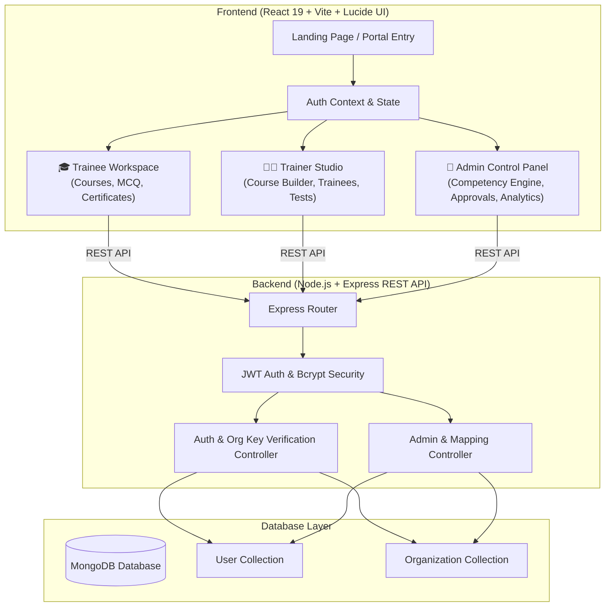
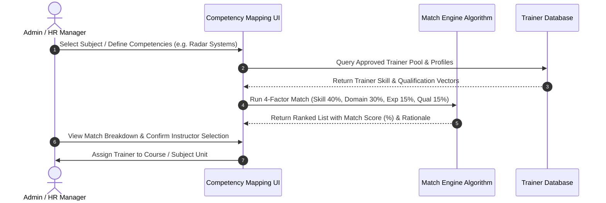

<div align="center">

# 🌐 Capacity Connect
### Next-Generation Enterprise & Institutional Capacity Building Platform
*Powered by SIH26075-Standard Algorithmic Competency Mapping & Multi-Tenant Role-Based Management*

[](https://react.dev/)
[](https://vitejs.dev/)
[](https://nodejs.org/)
[](https://www.mongodb.com/)
[](https://github.com/shubham2218k/Capacity-Connect)
[](LICENSE)

---

</div>

## 📌 Executive Summary

**Capacity Connect** is an advanced, enterprise-grade capacity building and workforce development ecosystem tailored for government ministries, scientific research institutes (such as IMD, MoES, NCMRWF, INCOIS, IITM, NDMA), and enterprise organizations. 

Built to address the complex requirements of **SIH26075**, Capacity Connect intelligently bridges organizational skill gaps by pairing specialized training subjects with domain experts using a **weighted 4-factor Competency Matching Engine**. The platform unifies **Trainees**, **Trainers**, and **Administrators** in a secure, multi-tenant environment powered by organization-scoped dual access keys.

---

## ⭐ Core Uniqueness & Key Highlights

### 🎯 1. SIH26075 Algorithmic Competency Mapping Engine
At the heart of Capacity Connect is a sophisticated matching algorithm that automatically scores and ranks candidate instructors against specialized subject benchmarks (e.g., Radar Systems & Severe Weather Detection, Atmospheric Dynamics, Marine Oceanography).
* **Weighted Scoring Formula**:
  * 🎯 **Skill Match (40% Weight)**: Evaluates exact and semantic overlap between required course competencies and trainer skillsets.
  * 🏢 **Primary Domain Alignment (30% Weight)**: Measures direct vs. secondary domain specialization.
  * ⏳ **Domain Experience (15% Weight)**: Scores field work and teaching experience against threshold prerequisites.
  * 🎓 **Academic Qualification (15% Weight)**: Grants weighted credit for Advanced Degrees (Ph.D., M.Tech, M.Sc.).
* **Dynamic Recommendation Rationale**: Generates transparent human-readable explanations explaining *why* a trainer is recommended.

### 🔑 2. Dual Access-Key Multi-Tenancy & Security
Organizations onboarded onto Capacity Connect receive dual cryptographically unique access keys:
* 🎓 **Trainee Access Key**: Restricts student self-registration to approved organizational domains.
* 👨‍🏫 **Trainer Access Key**: Enforces verified trainer applications and administrative approval gates.

### 📜 3. Automated Verified PDF Certification
Upon successfully passing course assessments, trainees automatically generate verifiable digital certificates rendered on-the-fly using `html2canvas` and `jspdf`.

### 📝 4. Real-Time Timed MCQ Assessment Engine
Features an interactive test environment complete with question navigation, countdown timers, instant scoring breakdown, pass/fail analysis, and automatic progression tracking.

### 📢 5. Target Broadcast & Announcements Hub
Admins can broadcast real-time announcements across the network, targeting specific roles (All Users, Trainers, or Trainees) or individual organization nodes.

---

## 🏗️ System Architecture



---

## 🧠 Competency Matching Workflow (SIH26075)



---

## 👥 Role-Based Feature Matrix

| Feature | 🎓 Trainee | 👨‍🏫 Trainer | 👑 Admin |
| :--- | :---: | :---: | :---: |
| **Self-Registration via Org Key** | ✅ | ✅ (Pending Approval) | ✅ |
| **Browse & Enroll in Courses** | ✅ | — | ✅ |
| **Interactive Video & Module Player** | ✅ | — | ✅ |
| **Timed MCQ Examinations** | ✅ | — | ✅ |
| **Download PDF Certificates** | ✅ | — | ✅ |
| **Course Creation & Module Editor** | — | ✅ | ✅ |
| **Assessment & Question Bank Creation**| — | ✅ | ✅ |
| **Trainee Progress & Gradebook View** | — | ✅ | ✅ |
| **Trainer Application Approval / Rejection**| — | — | ✅ |
| **SIH26075 Competency Mapping Engine**| — | — | ✅ |
| **Organization Access Key Management**| — | — | ✅ |
| **System Announcements Broadcast** | Read Only | Read Only | Create & Manage |
| **System-Wide Reports & Analytics** | — | Personal Performance | Full Ecosystem |

---

## 💻 Tech Stack & Infrastructure

### **Frontend Technologies**
* **Framework**: [React 19](https://react.dev/) with [Vite 8](https://vitejs.dev/)
* **Routing**: `react-router-dom` v7
* **Icons & UI System**: `lucide-react`
* **PDF & Canvas Export**: `jspdf` & `html2canvas`
* **Styling**: Vanilla CSS Design System with custom dark/light theme tokens and micro-interactions

### **Backend Technologies**
* **Runtime**: [Node.js](https://nodejs.org/) (v18+)
* **Framework**: [Express.js 4](https://expressjs.com/)
* **Database & ODM**: [MongoDB](https://www.mongodb.com/) with [Mongoose 8](https://mongoosejs.com/)
* **Authentication**: `jsonwebtoken` (JWT) & `bcryptjs`
* **Development Testing**: `mongodb-memory-server` & `nodemon`

---

## 🚀 Quick Start Guide

### Prerequisites
* **Node.js**: v18.0.0 or higher
* **npm**: v9.0.0 or higher
* **MongoDB**: Local MongoDB instance or MongoDB Atlas Connection URI

---

### 1. Clone the Repository
```bash
git clone https://github.com/shubham2218k/Capacity-Connect.git
cd Capacity-Connect
```

---

### 2. Backend Setup (`/server`)

```bash
# Navigate to server directory
cd server

# Install dependencies
npm install

# Create environment file (.env)
cp .env.example .env
```

Configure your `server/.env`:
```env
PORT=5000
MONGODB_URI=mongodb://127.0.0.1:27017/capacity_connect
JWT_SECRET=your_super_secret_jwt_key_here
CLIENT_URL=http://localhost:5173
```

Start the backend server:
```bash
# Development mode with Nodemon
npm run dev

# Or using local MongoDB memory server (for testing)
npm run mongo:local
```

The backend server will run on `http://localhost:5000`.

---

### 3. Frontend Setup (`/frontend`)

Open a new terminal window:
```bash
# Navigate to frontend directory
cd frontend

# Install dependencies
npm install

# Create environment file (.env)
cp .env.example .env
```

Configure your `frontend/.env`:
```env
VITE_API_BASE_URL=http://localhost:5000/api
```

Start the Vite frontend development server:
```bash
npm run dev
```

Open your browser and navigate to `http://localhost:5173`.

---

## 📡 API Reference Summary

### Authentication Routes (`/api/auth`)
* `POST /api/auth/register` - Register a new Trainee or Trainer using an Organization Access Key.
* `POST /api/auth/login` - Authenticate user and receive JWT session token.
* `GET /api/auth/me` - Fetch authenticated user profile and organizational context.

### Admin Routes (`/api/admin`)
* `GET /api/admin/trainers/pending` - List trainer registration applications requiring approval.
* `PUT /api/admin/trainers/:id/approve` - Approve trainer application.
* `PUT /api/admin/trainers/:id/reject` - Reject trainer application with rationale.
* `POST /api/admin/organizations` - Register a new organization and generate dual access keys.
* `GET /api/admin/competencies/match` - Execute SIH26075 Competency Matching algorithm for a training subject.

---

## 📂 Repository Structure

```
Capacity-Connect/
├── frontend/                   # React 19 + Vite Frontend Application
│   ├── public/                 # Static assets and favicon
│   ├── src/
│   │   ├── components/         # Navigation, Header, Footer, Cards, Modals
│   │   ├── context/            # AuthContext & State Management
│   │   ├── layouts/            # Trainee, Trainer & Admin Layout Shells
│   │   ├── pages/              # Trainee Pages (Dashboard, Player, MCQ, Certificates)
│   │   │   ├── admin/          # Admin Pages (CompetencyMapping, TrainerApprovals, SystemSettings)
│   │   │   └── trainer/        # Trainer Pages (CourseManagement, CreateAssessment, Performance)
│   │   ├── services/           # Axios/Fetch API Services (authService, announcementService)
│   │   ├── App.jsx             # Main Application Routing
│   │   └── index.css           # Global Design Tokens & Utility Classes
│   ├── package.json
│   └── vite.config.js
│
├── server/                     # Node.js + Express Backend API
│   ├── scripts/                # Local MongoDB memory server runner
│   ├── src/
│   │   ├── config/             # DB & Environment Configuration
│   │   ├── controllers/        # Auth, Admin & Competency Controllers
│   │   ├── middleware/         # JWT Verification & RBAC Middleware
│   │   ├── models/             # Mongoose Schemas (User, Organization)
│   │   ├── routes/             # Express API Routes (authRoutes, adminRoutes)
│   │   ├── app.js              # Express Application Setup & CORS
│   │   └── server.js           # Server Entry Point
│   ├── package.json
│   └── verify.js               # API & DB Integrity Verification Script
│
└── README.md                   # Project Documentation
```

---

## 📄 License

This project is licensed under the **MIT License**. See the [LICENSE](LICENSE) file for details.

---

<div align="center">
  <sub>Built with ❤️ for SIH26075 Enterprise & Institutional Capacity Building</sub>
</div>
